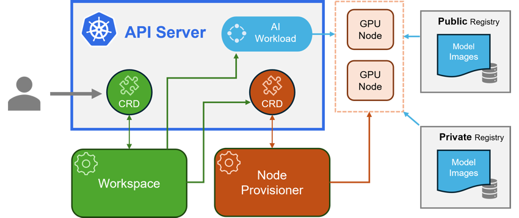

# Kaito-RAG

A simple document-based RAG application that uses Small Language Models (SLM) like [Microsoft Phi-3](https://azure.microsoft.com/en-us/products/phi-3), [Falcon 7b](https://falconllm.tii.ae/falcon-models.html) or [Mitral 7b](https://mistral.ai/news/announcing-mistral-7b/) to answer questions from the content of documents.

This RAG application uses the new [Kubernetes AI toolchain operator (Kaito)](https://learn.microsoft.com/en-us/azure/aks/ai-toolchain-operator), a Kubernetes operator provided as a managed add-on for Azure Kubernetes Service (AKS) that simplifies the experience of running Open-Source Software (OSS) AI models on your Azure Kubernetes Service (AKS) clusters.

## The Kubernetes AI toolchain operator (Kaito)

Kaito follows the classic Kubernetes Custom Resource Definition (CRD)/controller design pattern. The user manages a workspace custom resource that describes the GPU requirements and the inference specification. Kaito controllers automate the deployment by reconciling the workspace custom resource.



Under the hood, KAito uses [Karpenter](https://karpenter.sh/) to automatically provision the necessary GPU nodes based on a specification provided in the Workspace custom resource definition (CRD) and sets up the inference server as an endpoint for your AI models. This add-on reduces onboarding time and allows you to focus on AI model usage and development rather than infrastructure setup.

The major components of Kaito include:

1. **Workspace Controller**: This controller reconciles the workspace custom resource, creates machine custom resources to trigger node auto-provisioning, and creates the inference workload (deployment or statefulset) based on the model preset configurations.
2. **Node Provisioner Controller**: This controller, named gpu-provisioner in the [Kaito Helm chart](https://github.com/Azure/Kaito/blob/main/charts/Kaito/gpu-provisioner), interacts with the workspace controller using the machine CRD from [Karpenter](https://github.com/aws/karpenter-core). It integrates with Azure Kubernetes Service (AKS) APIs to add new GPU nodes to the AKS cluster. Note that the gpu-provisioner is an open-source component maintained in the Kaito repository and can be replaced by other controllers supporting Karpenter-core APIs.

Using Kaito greatly simplifies the workflow of onboarding large AI inference models into Kubernetes, allowing you to focus on AI model usage and development without the hassle of infrastructure setup.

### Benefits of using Kaito

There are some significant benefits of running open source LLMs or SLMs with Kaito. Some advantages include:

-   **Automated GPU node provisioning and configuration**: Kaito will automatically provision and configure GPU nodes for you. This can help reduce the operational burden of managing GPU nodes, configuring them for Kubernetes, and tuning model deployment parameters to fit GPU profiles.
-   **Reduced cost**: Kaito can help you save money by splitting inferencing across lower end GPU nodes which may also be more readily available and cost less than high-end GPU nodes.
-   **Support for popular open-source LLMs**: Kaito offers preset configurations for popular open-source LLMs. This can help you deploy and manage open-source LLMs on AKS and integrate them with your intelligent applications.
-   **Fine-grained control**: You can have full control over data security and privacy, model development and configuration transparency, and the ability to fine-tune the model to fit your specific use case.
-   **Network and data security**: You can ensure these models are ring-fenced within your organization's network and/or ensure the data never leaves the Kubernetes cluster.

## High-level Architecture

The following diagram shows the high-level architecture of the **Kaito-RAG** solution:


[Visio File](/assets/Architecture%20v0.1.vsdx)

## Prerequisites

-   An active [Azure subscription](https://docs.microsoft.com/en-us/azure/guides/developer/azure-developer-guide#understanding-accounts-subscriptions-and-billing). If you don't have one, create a [free Azure account](https://azure.microsoft.com/free/) before you begin.
-   [Visual Studio Code](https://code.visualstudio.com/) installed on one of the [supported platforms](https://code.visualstudio.com/docs/supporting/requirements#_platforms) along with the [HashiCorp Terraform](https://marketplace.visualstudio.com/items?itemName=HashiCorp.terraform) and the [C# Development Kit](https://marketplace.visualstudio.com/items?itemName=ms-dotnettools.csdevkit).
-   Azure CLI version 2.59.0 or later installed. To install or upgrade, see [Install Azure CLI](https://learn.microsoft.com/en-us/cli/azure/install-azure-cli).
-   `aks-preview` Azure CLI extension of version `2.0.0b8` or later installed
-   [Terraform v1.9.0 or later](https://developer.hashicorp.com/terraform/downloads).
-   The deployment must be started by a user who has sufficient permissions to assign roles, such as a `User Access Administrator` or `Owner`.
-   Your Azure account also needs `Microsoft.Resources/deployments/write` permissions at the subscription level.
-   During deployment, the script will create an application registrations on Microsoft Entra ID. Please verify that your user account has the necessary privileges.

### Activate Kaito in your Azure Subscription

Before creating an AKS instance with Kaito support, it is important to turn on the `AIToolchainOperatorPreview` feature flag on your subscription.

-   Register the `AIToolchainOperatorPreview` feature flag using the [az feature register](https://learn.microsoft.com/en-us/cli/azure/feature#az_feature_register) command.

    ```bash
    az feature register --namespace "Microsoft.ContainerService" --name "AIToolchainOperatorPreview"
    ```

    It takes a few minutes for the registration to complete. Please be patient!

-   Verify the registration using the [az feature show](https://learn.microsoft.com/en-us/cli/azure/feature#az_feature_show) command.

    ```bash
    az feature show --namespace "Microsoft.ContainerService" --name "AIToolchainOperatorPreview"
    ```

    Wait until the status changes from `Registering` to `Registered` →

    ```json
    {
        "id": "/subscriptions/…/providers/Microsoft.Features/providers/Microsoft.ContainerService/features/AIToolchainOperatorPreview",
        "name": "Microsoft.ContainerService/AIToolchainOperatorPreview",
        "properties": {
            "state": "Registered"
        },
    "type": "Microsoft.Features/providers/features"
    }
    ```

## Infrastructure as Code - IaC

The Kaito-RAG solution provides Terraform scripts to deploy the infrastructure on your Azure subcriotion. Please revire the variables (and parameters) configuration before deployment to ensure that the default values suit your needs and requirements.

## Contributing

This project welcomes contributions and suggestions. Most contributions require you to agree to a Contributor License Agreement (CLA) declaring that you have the right to, and actually do, grant us the rights to use your contribution. For details, visit https://cla.opensource.microsoft.com.

When you submit a pull request, a CLA bot will automatically determine whether you need to provide a CLA and decorate the PR appropriately (e.g., status check, comment). Simply follow the instructions provided by the bot. You will only need to do this once across all repos using our CLA.

## Code of Conduct

This project has adopted the [Microsoft Open Source Code of Conduct](https://opensource.microsoft.com/codeofconduct/).

For more information see the [Code of Conduct FAQ](https://opensource.microsoft.com/codeofconduct/faq/) or contact [opencode@microsoft.com](mailto:opencode@microsoft.com) with any additional questions or comments.

## Trademarks

This project may contain trademarks or logos for projects, products, or services. Authorized use of Microsoft trademarks or logos is subject to and must follow [Microsoft's Trademark & Brand Guidelines](https://www.microsoft.com/en-us/legal/intellectualproperty/trademarks/usage/general). Use of Microsoft trademarks or logos in modified versions of this project must not cause confusion or imply Microsoft sponsorship.

Any use of third-party trademarks or logos are subject to those third-party's policies.
